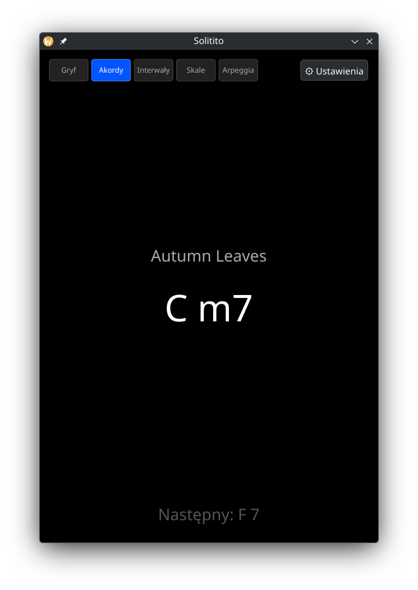
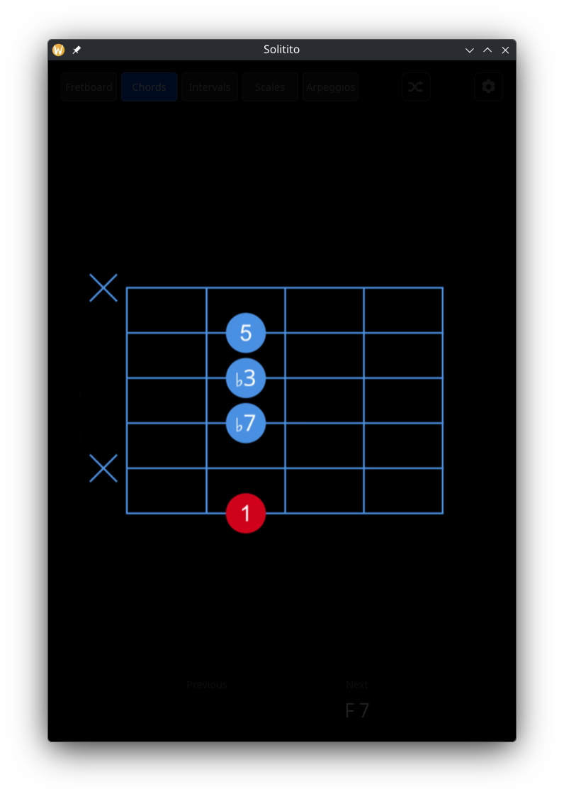
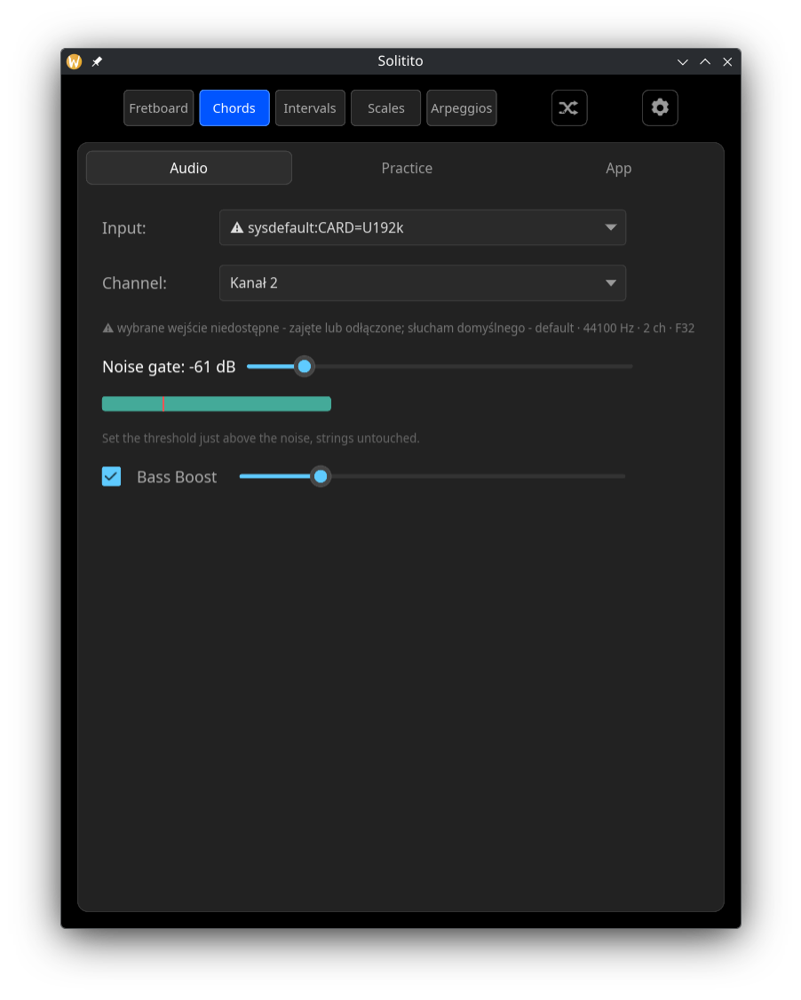
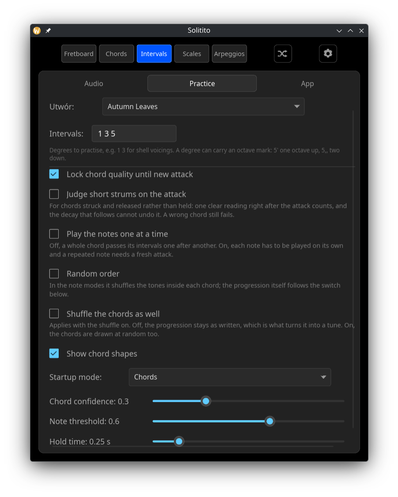
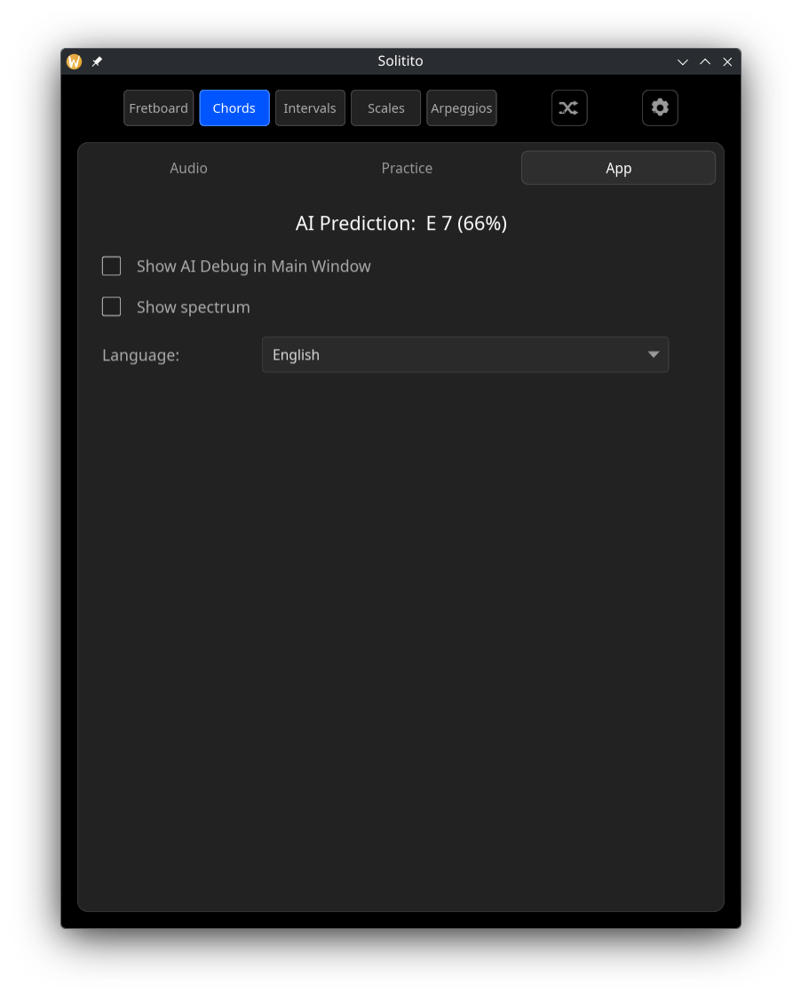

# Solitito — Real-Time Polyphonic Guitar Trainer

**Solitito** is a real-time guitar trainer written in **Rust**. It listens to your guitar
through an audio interface (recommended) or a microphone, recognises what you are playing,
and walks you through jazz standards, intervals, scales and arpeggios.

Recognition runs on a small neural network (7.3M parameters) exported to ONNX. Everything —
DSP, inference, UI — happens locally on the CPU. No network, no cloud, no account.

<div align="center">


</div>

Chord shapes are labelled with **intervals, not fingerings**, so one diagram covers
all twelve keys: the red dot is the root, and the shape moves. Clicking shape of chord 
enlarges it.

Solitito is heavily inspired by [Solo](https://www.solotrainer.app/), an Android/iOS guitar
trainer I use daily. Solo does far more, and does it well — but it hears one note at a time.
That was the one thing that bothered me: playing intervals through changes, you have to mute
the strings for each note to register, which is an unmusical way to practise. I kept wondering
how Yousician managed it, since that one does recognise chords.

Solitito is a desktop application for Linux and Windows. There are no plans for mobile versions.

Development started in December 2025. The data pipeline was rewritten from scratch more than
once before it worked. Most of what follows is a record of what turned out to matter.

---

## What it does

Pick a song, and the app shows one chord at a time. Play it. When the model hears the right
chord, the app moves on to the next one.

- **Chords** — full jazz standards. Green confirms an exact match, yellow accepts a triad or
  a common substitution (a rootless voicing, an `m7` read as `m`), red means the chord was
  detected but the signal is too weak to lock.
- **Intervals** — play the chord tones one at a time. You choose which degrees to practise
  (`1 3 5` for triads, `1 3 5 7` for sevenths, `1 3` for shell voicings). '3' matches both
  3 and b3, '7'  = 7 and b7, etc - depending on current chord's quality.
- **Scales** — sequential note practice from a scale definition.
- **Arpeggios** — chord tones in sequence over a progression, written as degrees so one
  pattern fits every chord in a standard. Two-octave jazz phrases, plus a generator that
  builds a fresh one after every pass.
- **Fretboard** — a region of the neck is selected at random (a set of strings, four frets) and
  held; you are asked for notes that live inside it. For learning where the notes are in one
  hand position.

Bottom part of main window shows the chord just played and the next one, after the current one. 
The chord left behind keeps the colour it earned — green for an exact match, yellow if a triad
or a substitution got it through — so a pass stays readable after the app has moved on. 

A shuffle toggle randomises the order. In the note modes it shuffles the tones inside each
chord and leaves the progression as written — shuffled intervals walking a real progression
turn into tunes, where shuffling both is an experiment; a separate setting adds the chords.
In Chords it reorders the standard, and in Scales it redraws the key. A pause button freezes progression while the colours keep
reporting whether the chord is right, so you can sit on one shape and work it out; while
paused, arrows either side of the strip step back and forth through the progression, for
going back to a chord that has already gone by.

---

## ⚙️ Settings

Three tabs: **Audio** for the input and the noise gate, **Practice** for what to play and how
strictly it is judged, **App** for what the window shows.

<div align="center">



</div>

| Setting | Description |
|---|---|
| **Song / Scale** | Chooses the progression or scale for the current mode |
| **Pattern** | Arpeggios only: which phrase to walk. The last entry is a generator that builds a fresh one after every pass |
| **Key** | Scales only: the tonic. With random order on, it is redrawn after each pass |
| **Intervals** | Which degrees to practise. `1 3 5` for triads, `1 3 5 7` for sevenths, `1 3` for shell voicings. `3` matches both major and minor thirds, `5` matches perfect and diminished fifths, according to the chord quality |
| **Show AI Debug in Main Window** | Shows the raw prediction on the main screen |
| **Input** | Which capture device to open. *System default* follows whatever the OS is set to. Saved, and falls back to the default if that device is gone |
| **Channel** | Which input of that device to listen on — a guitar in socket 2 of an interface is channel 2. Shown only when the device has more than one, and there is no mixing option: averaging the inputs pulls in whatever is on the other socket and costs 6 dB |
| **Noise gate** | Threshold in dBFS. The bar below shows the current input level on the same scale, with the threshold marked in red — set it just above the noise with the strings untouched |
| **Bass Boost** | Digital amplification of the lowest CQT bins. Useful for laptop microphones, which usually roll off the low strings |
| **Lock chord quality until new attack** | Holds the recognised quality until you strike the strings again. Without it, a held `m7` turns into `m` as the seventh dies away |
| **Judge short strums on the attack** | For chords struck and released rather than held. One clear reading of the target counts, and the decay that follows cannot undo it. A wrong chord still fails |
| **Play the notes one at a time** | Note modes only. Off, a strummed chord passes its intervals one after another — the pitch head is polyphonic and reports every tone at once. On, each note has to be played on its own, the CQT estimate overrules the model, and a repeated note needs a fresh attack |
| **Random order** | The shuffle icon on the toolbar. In the note modes it shuffles the tones inside each chord; in Chords it reorders the progression, and in Scales it redraws the key after every pass |
| **Shuffle the chords as well** | Intervals and Arpeggios only, and only with the shuffle on. Off, the progression stays as written and just the tones move — shuffled intervals walking a real progression turn into tunes. On, the chords are drawn at random too, which is the more abstract exercise |
| **Show chord shapes** | The diagram thumbnails under the chord name in Chords mode |
| **Startup mode** | Which mode the app opens in |
| **Language** | Auto (from the system locale), Polski, English. Applied immediately, no restart |
| **Chord confidence** | How sure the model must be of the chord *name* before it counts (Chords mode) |
| **Note threshold** | How sure the model must be that a *single note* is sounding (Intervals / Scales / Arpeggios) |
| **Hold time** | How long a correct chord must be held before advancing |

The line under `Channel` says what actually opened — device, sample rate, channel count
and sample format. `./solitito --help` lists every option. `./solitito --devices` prints the same information for every device the backend can see, and `./solitito --bench` times one model inference — the app asks the model every 40 ms while a chord rings, so that figure is essentially the whole of its CPU load. A release build has the `windows` subsystem, so on Windows these modes write to the console that launched them; started with no console at all — from a shortcut carrying the flag — the program opens one of its own and waits for a key, so the report can be read.

### What the names mean on Linux

`default`, `pulse`, `pipewire` and `jack` are not devices. They are paths to a sound server, and
under PipeWire they all arrive at whatever the desktop has set as the default source. That source
is often a single socket exported as mono (e.g. built-in microphone), which the ALSA compatibility 
layer then hands over as two identical channels — so the channel picker has nothing to choose between 
and appears to do nothing. Which socket you get is decided in the desktop's own sound settings.

Names like `sysdefault:CARD=U192k` are ALSA cards. The card name comes from the chipset rather
than the model — a Behringer UMC202HD reports as `U192k`, an onboard codec usually as `Generic`.
Picking the card gives its sockets as real separate channels, but only if the card is free:
PipeWire normally claims it, and then every name still ends at the server.

This is also why the list is sometimes short. A card can be opened once, so a card that PipeWire or
another app is holding is missing from the scan entirely and only the four server names remain. The
list is re-scanned whenever the settings panel opens and never loses an entry it once had, so a card
that frees up appears without a restart. If the chosen device cannot be opened, the app says so under
`Channel` and listens on the default — where both channels usually carry the same signal.

None of this applies to Windows, where an interface appears as one stereo device and the channel
picker means what it says.

Settings live in `$XDG_CONFIG_HOME/solitito/settings.json` (falling back to `~/.config` or
`%APPDATA%`). A missing or corrupted file falls back to defaults rather than blocking
startup.

There is also a diagnostic mode:

```bash
SOLITITO_DEBUG=1 ./solitito
```

For every prediction it prints the top three qualities and the full pitch vector expressed as
**intervals relative to the detected root**:

```
G m7  | min7=97% sus=0% maj=0% | R96# b25 28 b382# 37 44 b56 594# b616 69 b797# 74
```

This is what separates "the model cannot hear the seventh" from "it hears it and ignores it"
— two problems that look identical from the chord name alone and lead in opposite directions.

`./solitito --probe recording.wav` answers the same kind of question about a whole recording:
it runs the file through the live feature path with nothing gated away and prints, for every
window, the input level, how full the model's context window was, the twelve pitch
probabilities and the note the CQT alone reports — so "the model cannot hear it" and "the app
never asked" stop looking alike.

### Why single notes are not judged by the model alone

The model is asked about 48 frames, which is 0.77 s of audio, and it answers about all of it.
That is right for a chord you hold and wrong for a scale: measured on a scale at 0.6 s per
note, the pitch head named the note being played in 7% of windows and the one before it in
79%. Nothing is broken there — the model is reporting both notes it heard, because both were
in the window.

So the note modes ask a second question of a single CQT frame, which has no memory: a
harmonic sum over the log-magnitude bins gives the pitch class sounding right now. On the same
scale it named the current note 57% of the time and never named one that was not played. The
remaining lag is the 8192-sample FFT window, half a second wide, which is also why notes
shorter than about 0.4 s are still hard.

By default that estimate only ADDS a way to pass, because overruling the model would cost
something worth keeping: the pitch head is polyphonic, so strumming a whole chord walks its
intervals one by one, which no monophonic tuner can do. **Play the notes one at a time** turns
the estimate into the authority — then the model's window cannot credit the note before the
one under your fingers, and a repeated note needs a fresh attack.

---

## How it works

### Signal path

```
audio in → resample to 16 kHz → FFT (8192) → sparse pseudo-CQT → features → ONNX model
```

1. **Resampling.** Input is resampled to 16 kHz. The CQT spans 6 octaves from C1, so the
   highest bin sits around 2 kHz — far below the 8 kHz Nyquist limit.
2. **Pseudo-CQT.** Instead of a real constant-Q transform, the app multiplies the FFT
   spectrum by a precomputed kernel (144 bins, 24 per octave — quarter-tone resolution).
   The kernel comes from `librosa.filters.constant_q`, so the app and the trainer produce
   the same features.
3. **Features.** 168 values per frame: 144 CQT bins + 12 chroma + 12 bass-energy bins.
   The model sees 48 frames of history (0.77 s at a 256-sample hop).
4. **Inference.** One forward pass every 40 ms.

The CQT kernel is stored in a **sparse CSR format**. The full kernel has 4097×144 = 589,968
weights, but they concentrate around each bin's centre frequency. Dropping everything below
1e-4 of the peak keeps 6.9% of the weights and changes the output by 0.03% of peak
(measured on white noise, pink noise and a guitar-like harmonic series). The weights file
shrinks from 28 MB to 2 MB, and the audio thread does about 14× fewer multiplications per
frame.

### Model

A hybrid CNN + Transformer with three output heads:

| Stage | Detail |
|---|---|
| Input | `[48 frames, 168 features]` |
| CNN | Convolutional blocks with Squeeze-and-Excitation, InstanceNorm |
| Encoder | Transformer encoder with a CLS token, 384-dim |
| `root_logits` | 13 classes — 12 pitch classes + "Noise" |
| `quality_logits` | 11 classes — maj, min, maj7, dom7, min7, m7b5, dim7, aug, sus, note, N |
| `pitch_logits` | 12 sigmoid outputs — which pitch classes are sounding |

The three heads answer different questions and are **not** interchangeable:

- `pitch_logits` is the strongest output (F1 0.909). It answers "which notes are sounding
  right now", which is exactly what the Intervals / Scales / Arpeggios modes need.
- `root_logits` names the tonal centre. 98.1%.
- `quality_logits` names the chord family. This is the hard one.

---

## Training data

Two sources, solving different problems.

### 1. Synthetic set — exact labels

Generated by `dist/dataset_generator_v2.py`. One Guitar Pro file plus the annotations,
written directly:

1. The generator lays out 394 blocks of 6 s each (3 measures at 120 BPM) covering 12 roots ×
   {maj, min, maj7, dom7, min7, m7b5, dim7, sus4, aug} in several fretboard positions, plus
   all 96 single notes (6 strings × 16 frets).
2. Before generating, it **self-tests every movable shape at every fret** and checks that it
   actually produces the declared intervals. A typo in the shape table stops generation
   instead of silently poisoning the dataset.
3. It writes `synth_annotations.csv` at the same time as the GP5. The generator knows which
   measure each block occupies, so nothing has to be recovered from audio later.
4. The guitar track is exported as a DI signal and rendered in a DAW through
   [NAM](https://www.neuralampmodeler.com/) twice: `synth_dataset_clean.wav` (Fender Deluxe
   Reverb clean) and `synth_dataset_eob.wav` (edge of breakup).
5. `dataset_generator_v2.py --calibrate <wav>` measures where the first attack lands, in case
   the DAW added silence at the start.
6. `verify_annotations.py` compares each label against the actual audio content before
   training.


**The generator emits labels directly, and a  separate script verifies that the labels describe the audio.** Full procedure in
[dist/HOW_TO_PREPARE_DATASET.md](dist/HOW_TO_PREPARE_DATASET.md).

### 2. GuitarSet — real guitar

[GuitarSet](https://guitarset.weebly.com/) is 360 recordings with JAMS annotations, captured
with a hexaphonic pickup. 

## Results

Model `v2_take6`, measured on a source-grouped validation split with solo windows excluded:

| metric | value |
|---|---|
| Root accuracy | **98.1%** |
| Pitch F1 | **0.909** |
| Exact match (root **and** quality) | **92.4%** |

Per-quality accuracy at the best checkpoint: `dom7` 97%, `min7` 93%, `min` 92%, `sus` 91%,
`maj` 89%, `maj7` 89%; `m7b5`, `dim7` and `aug` above 97%.

The train–validation gap on quality is 6.5 points, so the model sits close to the ceiling its
data allows. More epochs will not help; more varied real-guitar recordings would.

The same pipeline, measured honestly at each stage:

| run | change | exact match |
|---|---|---|
| take4 | source-grouped split — honest baseline | 44.8% |
| take5 | solo recordings masked | 82.3% |
| take6 | `performed` chord annotations | **92.4%** |

---

## 📄 Custom file formats

`user_songs.txt`

```
My Song Title
Cm7 F7 BbMaj7 EbMaj7
```

`user_scales_def.txt`

```
My Scale Name
1 b2 3 4 5 b6 7
```

---

## Running it

Ready packages are attached to each [release](../../releases) — binary, ONNX
Runtime, the model and the DSP weights, nothing else needed:

```bash
tar xzf solitito_linux-*.tar.gz && cd solitito_linux-* && ./solitito.sh
```

On Windows, unpack the zip and run `solitito.exe`.

### From source

```bash
cargo build --release
```

The binary needs two files in its working directory. `dsp_weights.json` is in
this repository; the model is not, because it is 29 MB:

```bash
curl -LO https://huggingface.co/greblus/solitito-ai/resolve/main/best_model_v2_take6.onnx
```

`./solitito --check` loads both and reports whether they are usable, which is
also what the release workflow runs against every package it builds.

The app refuses to start on an old dense `dsp_weights.json` rather than accepting
it silently: the previous format also carried a different chroma mapping, which
would feed the model features it was not trained on. Regenerate with
`python dist/gen_weights.py` (needs librosa).

```bash
cargo build --release
./target/release/solitito
```

## Detailed Project summary

`docs/` holds a long-form write-up of the whole system: architecture, the four
GuitarSet defects and what fixing each one was worth, the training procedure,
the measurements behind every design decision, and the hypotheses that
measurement refuted. Same document in two languages, Markdown and PDF.

| file | |
|---|---|
| [`docs/Solitito_project_summary_en.md`](docs/Solitito_project_summary_en.md) | [PDF](docs/Solitito_project_summary_en.pdf) |
| [`docs/Solitito_project_summary_pl.md`](docs/Solitito_project_summary_pl.md) | [PDF](docs/Solitito_project_summary_pl.pdf) |

## Repository and dataset

- Model and DSP weights: <https://huggingface.co/greblus/solitito-ai>
- Dataset v2 (renders and annotations): <https://huggingface.co/datasets/greblus/solitito_dataset_v2>

Those two hold binary artifacts only. All code lives here.

The `dist/` directory contains everything used to build the dataset and train the model:

| file | role |
|---|---|
| `dataset_generator_v2.py` | generates the GP5 **and** the annotations; self-tests all shapes |
| `verify_annotations.py` | checks that labels describe the audio (numpy only, no librosa) |
| `model_trainer.py` | training; runs on Kaggle, checkpoints to Hugging Face |
| `gen_weights.py` | sparse pseudo-CQT weights for the Rust side |
| `probe_root.py` | how often the labelled root is actually audible |
| `probe_quality.py` | where chord quality should come from: the head or the pitch vector |
| `probe_sources.py` | which GuitarSet chord annotation to use |
| `inspect_jams.py` | what is actually inside the JAMS files |

---

[1] This project uses the GuitarSet dataset by Qingyang Xi, Rachel M. Bittner, Johan Pauwels,
Xuzhou Ye & Juan P. Bello, available at <https://guitarset.weebly.com/>, licensed under
Creative Commons Attribution 4.0 International (CC BY 4.0).
