<!-- # Solitito — Real-Time Polyphonic Guitar Trainer -->

*[Wersja polska](README_pl.md)*

**Solitito** is a real-time guitar trainer written in **Rust**. It listens to your guitar
through an audio interface (recommended) or a microphone, recognises what you are playing,
and walks you through jazz standards, intervals, scales, arpeggios and interval formulas.

Recognition runs on a small neural network (7.3M parameters) exported to ONNX. Everything —
DSP, inference, UI — happens locally on the CPU. 

<div align="center">

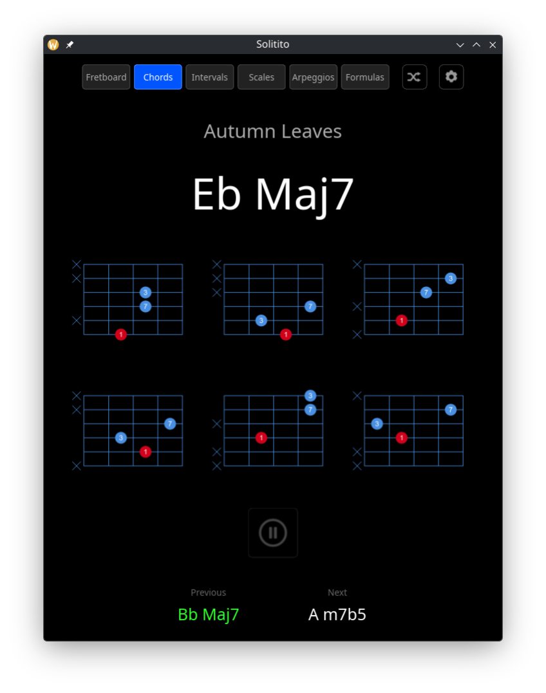

</div>

Chord shapes are labelled with **intervals, not fingerings**, so one diagram covers
all twelve keys: the red dot is the root, and the shape moves. Clicking shape of chord 
enlarges it. The middle shot shows the same chord as **shell voicings** — third and
seventh over the root, with the fifth left out — which is the other thing the shapes
can be drawn as.

Solitito is heavily inspired by [Solo](https://www.solotrainer.app/), an Android/iOS guitar
trainer I use daily. Solo does far more, and does it well — but it hears one note at a time.
That was the one thing that bothered me: playing intervals through changes, you have to mute
the strings for each note to register, which is slightly unmusical way to practise. I kept wondering
how Yousician managed it, since that one know how to recognise chords and that's how the idea
of Solitito was born.

Solitito is a desktop application for Linux and Windows. There are no plans for mobile versions.

Development started in December 2025. The data pipeline was rewritten from scratch more than
once before it worked. Most of what follows is a record of what turned out to matter.

---

## What it does

Pick a song, and the app shows one chord at a time. Play it. When the model hears the right
chord, the app moves on to the next one.

- **Fretboard** — a region of the neck is selected at random (a set of strings, four frets) and
  held; you are asked for notes that live inside it. For learning where the notes are in one
  hand position.
- **Chords** — full jazz standards. Green confirms an exact match, yellow accepts a triad or
  a common substitution (a rootless voicing, an `m7` read as `m`), red means the chord was
  detected but the signal is too weak to lock.
- **Intervals** — play the chord tones one at a time. You choose which degrees to practise
  (`1 3 5` for triads, `1 3 5 7` for sevenths, `1 3` for shell voicings). '3' matches both
  3 and b3, '7'  = 7 and b7, etc - depending on current chord's quality.
- **Scales** — sequential note practice from a scale definition.
- **Arpeggios** — chord tones in sequence over a progression, written as degrees so one
  pattern fits every chord in a standard. Two-octave jazz phrases, plus a generator that
  builds a fresh one after every pass.

<div align="center">
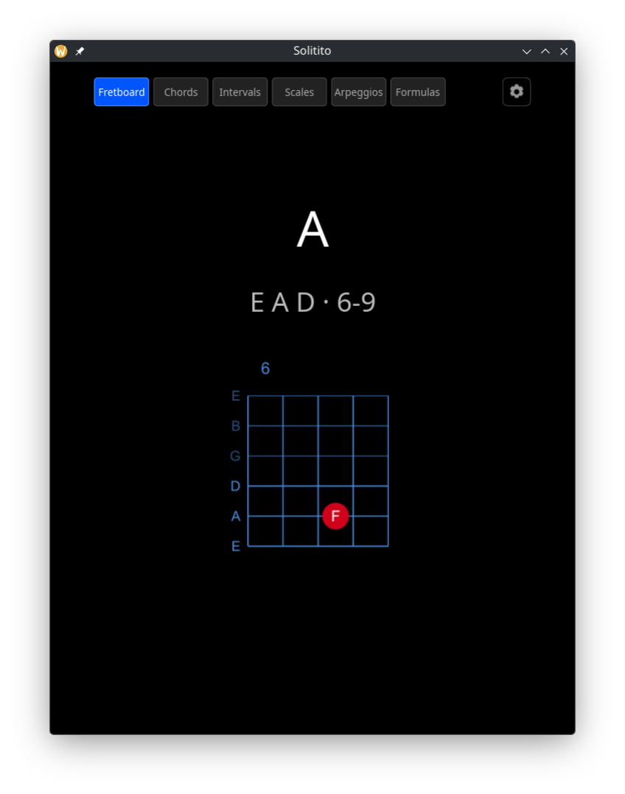
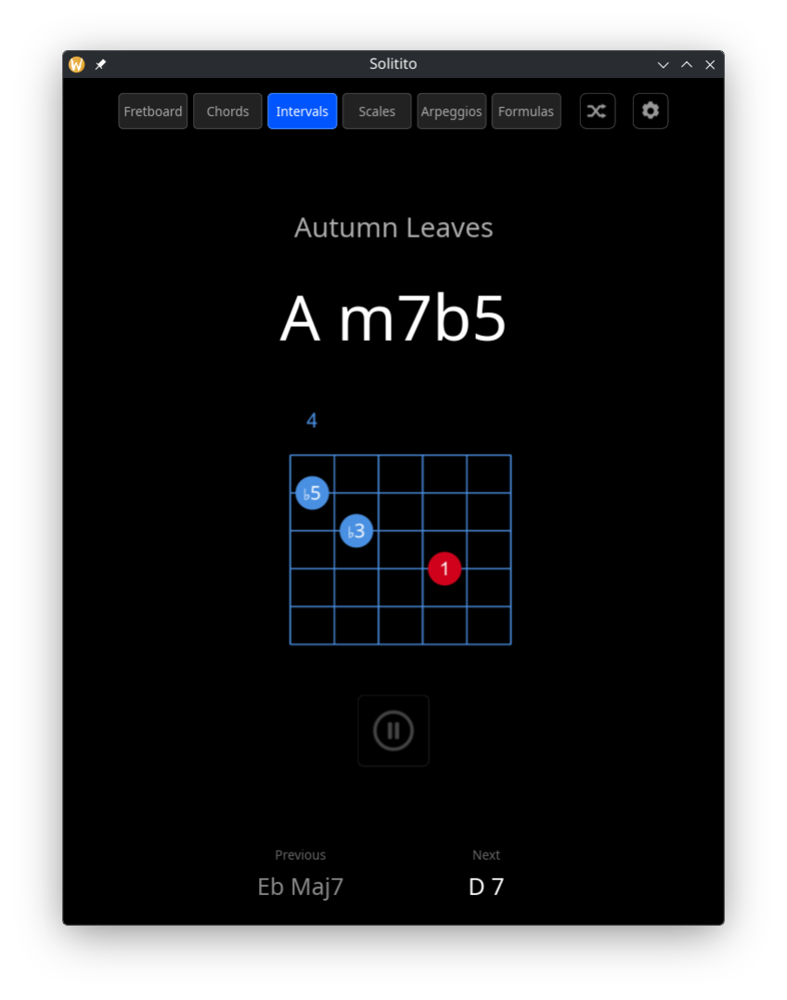
</div>

<div align="center">
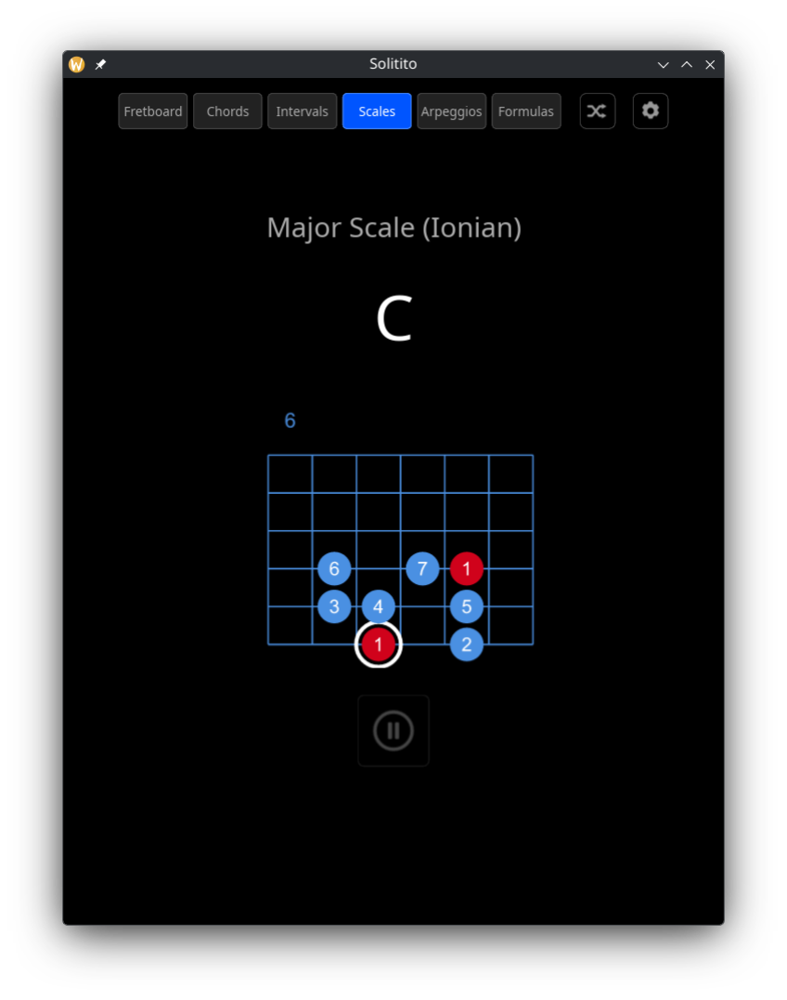
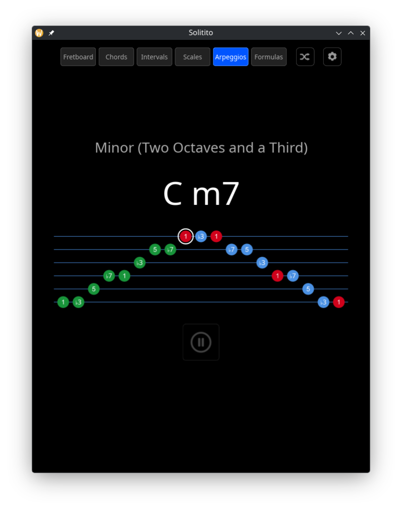
</div>

- **Formulas** — a set of intervals drawn over a root, played in any order. Each function
  lights up as it sounds, and the set is finished when all of them have; underneath, the
  nearest scale you already know, with the formula's own degrees picked out of it, and the
  chords that fit inside it — point at one and the row above shows what it is built from.
  Pause turns the set blue and stops judging altogether: your turn, improvise inside it.
  The same formula can also be planted on a chord, or carried across a whole standard —
  see [practising with formulas](docs/formulas-practice.md) for how to work with all three.

The Formulas mode is inspired by **An Improviser's OS** by Wayne Krantz — possibly the most
interesting approach to creative improvisation ever put together.

The book is available from [Wayne Krantz](https://waynekrantz.bandcamp.com/merch/wayne-krantz-an-improvisers-os-2nd-edition) directly.

<div align="center">
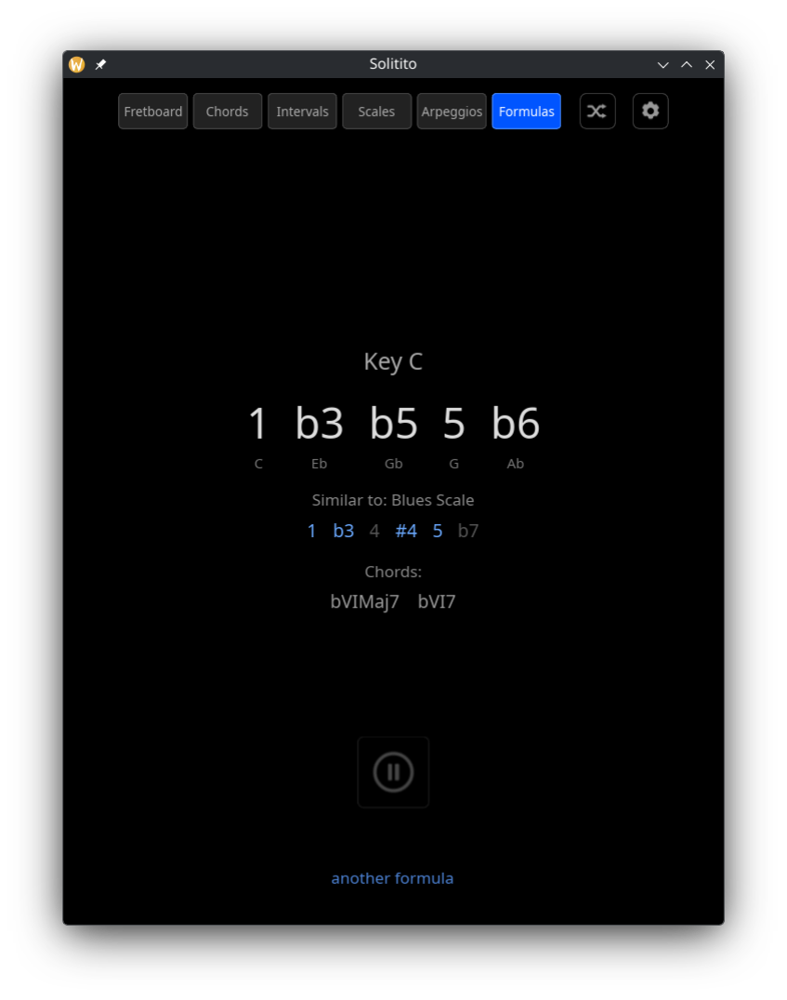
</div>

A formula worth coming back to is kept with the **star** under it: it asks for a name, and
the name goes on the list in Practice settings, where picking one draws that formula again
over whatever key is on screen — a formula is key-independent, so only the set is stored.
The cross on a row throws it out, and the star, filled in, drops the one on screen.

The line under the scale reads **chords that fit inside the formula** — every note of them
is in the set, so the formula covers them without leaving it once. They are written as a
degree in roman numerals plus a quality, the degree counted from the formula's own root:
in the shot above `VI`, `VIm` and `VIsus2` all stand on `VI`, which in the key of E is C#.

The major and the minor triad on the same degree both appear because the formula holds `1`
and `b2` alike — E and F, which read from C# are its major and minor third — and `7`, the
D# that makes the sus2. Loop any of those chords and the formula is a colour for it: every
note lands.

Roman for the chords, arabic for the functions above them, so the two rows cannot be
confused — a dominant seventh on the second degree written in arabic reads "27". Only the
fullest chords are listed: one that fits inside another already there is played whenever
that one is.

It is amazing how a "two-liner" in Python can hold a whole musical world:

```python
from itertools import combinations

F = "1 b2 2 b3 3 4 b5 5 b6 6 b7 7".split()
formulas = [("1", *c) for n in range(12) for c in combinations(F[1:], n)]

len(formulas)  # 2048
```

Formulas are all subsets of the 12 chromatic functions that contain “1” — that is,
2¹¹ = 2,048—sorted first by the number of notes, then lexicographically in chromatic order.

Bottom part of main window shows the chord just played and the next one, after the current one. 
The chord left behind keeps the colour it earned — green for an exact match, yellow if a triad
or a substitution got it through — so a pass stays readable after the app has moved on. 

A shuffle toggle randomises the order. In Intervals it shuffles the tones inside each chord
and leaves the progression as written — shuffled intervals walking a real progression turn
into tunes, where shuffling both is an experiment; a separate setting adds the chords. In
Scales and Arpeggios it does not touch the order at all: a scale not walked in order is not a
scale, and a study dealt at random is not that study. There it draws the KEY instead. A scale
also starts from a drawn string after every pass, shuffle or no shuffle, and runs up or down
as the same draw decides — the shape is the same everywhere, one place on the neck practised
over and over is not the exercise, and a scale known upwards only is half known.
In Chords it reorders the standard, and in Scales it redraws the key. A pause button freezes progression while the colours keep
reporting whether the chord is right, so you can sit on one shape and work it out; while
paused, arrows either side of the strip step back and forth through the progression, for
going back to a chord that has already gone by.

### The chord, scales and arpeggio visual shapes are for the beginning

Every note mode can be shown three ways: a line of degree names, tablature, or the neck
itself — and, if you want, with fret numbers in the dots instead of degrees. The shapes
help while the intervals are still new: they say where the fingers go, and the fret numbers
help further still, for when a shape has to be found on the neck before its degrees mean
anything.

The idea is to stop using them. What this app is for is hearing intervals, not memorising
shapes: reading `1 ♭3 5 ♭7` off a diagram is playing a box, hearing it is playing music. As
the degrees become familiar, switch back to the line of names, and later practise without
the pictures at all.

---

## ⚙️ Settings

Four tabs: **Audio** for the input and the noise gate, **General** for how strictly what you
play is judged, **Practice** for what to play, and **App** for what the window shows.

<div align="center">


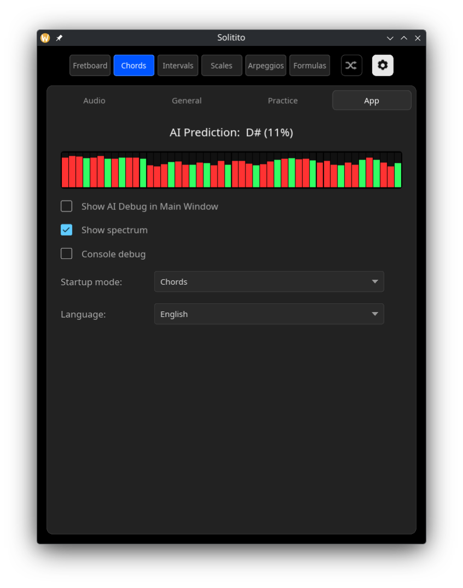
</div>

**Practice** holds only what belongs to the mode on screen — a song has nothing to say in
Formulas, a formula nothing in Chords — so it is a different tab in each of them, and the
fretboard trainer, which has no settings of its own, does not show it at all:

<div align="center">
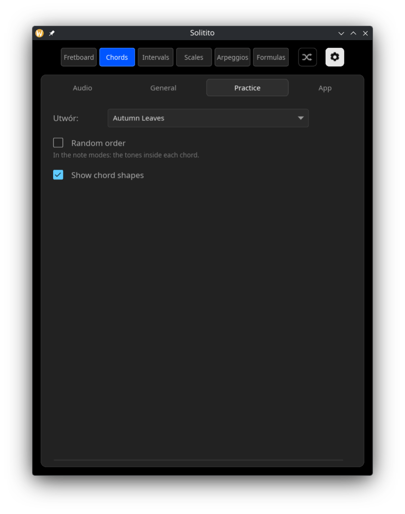
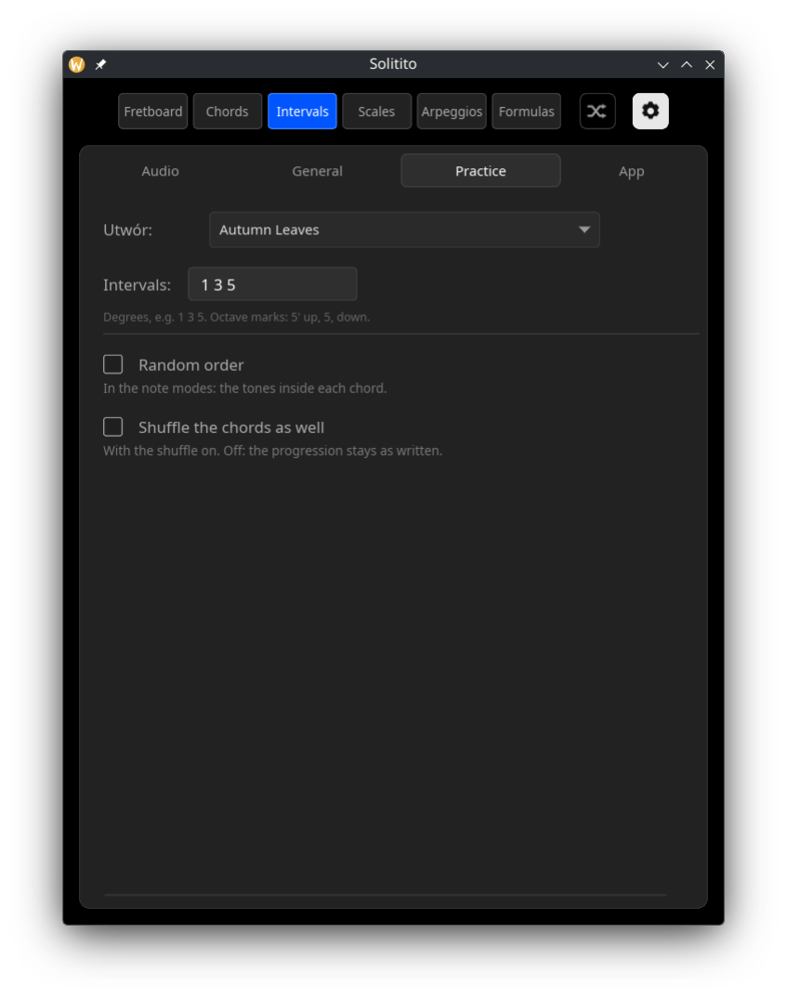
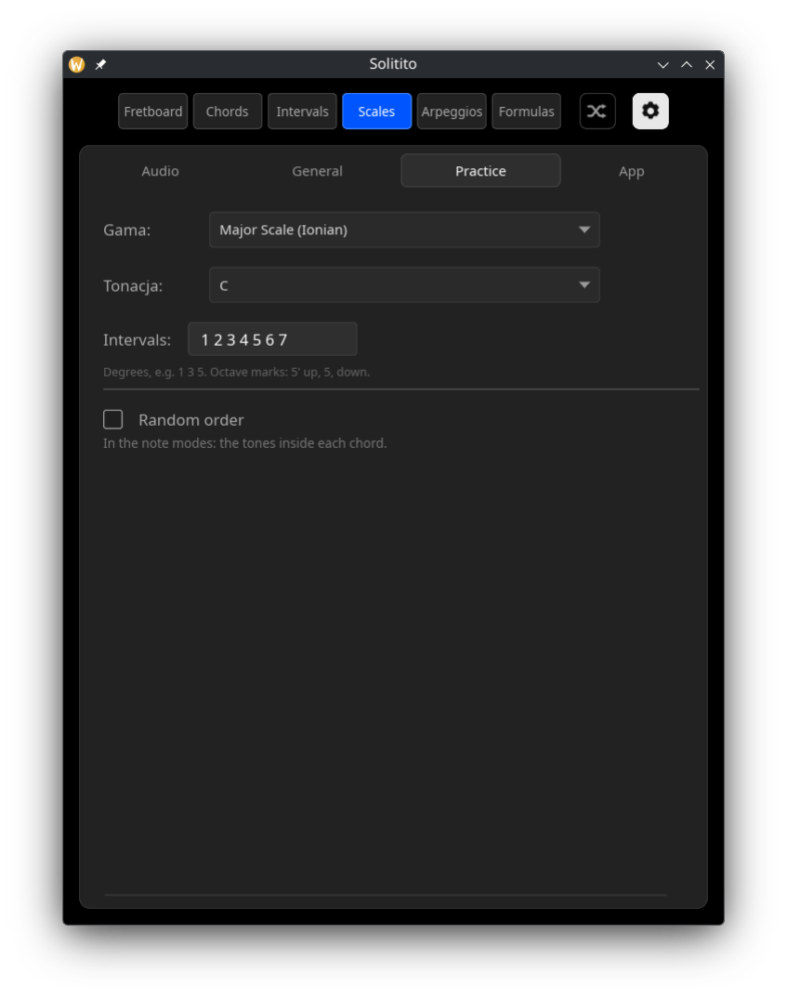
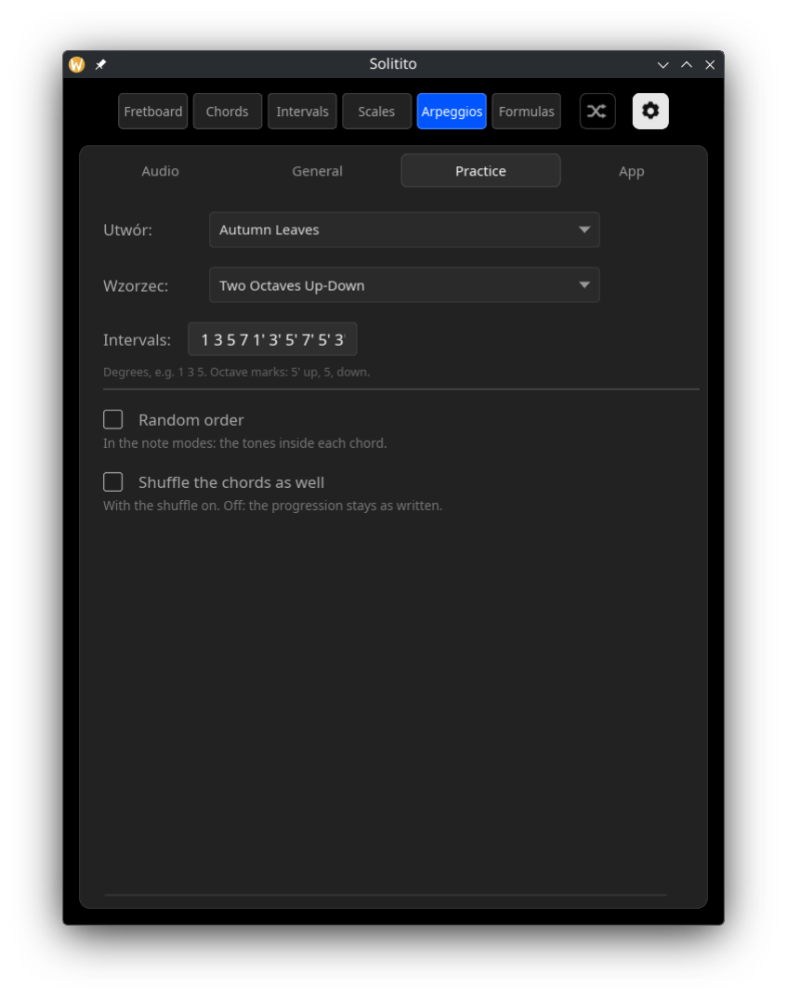
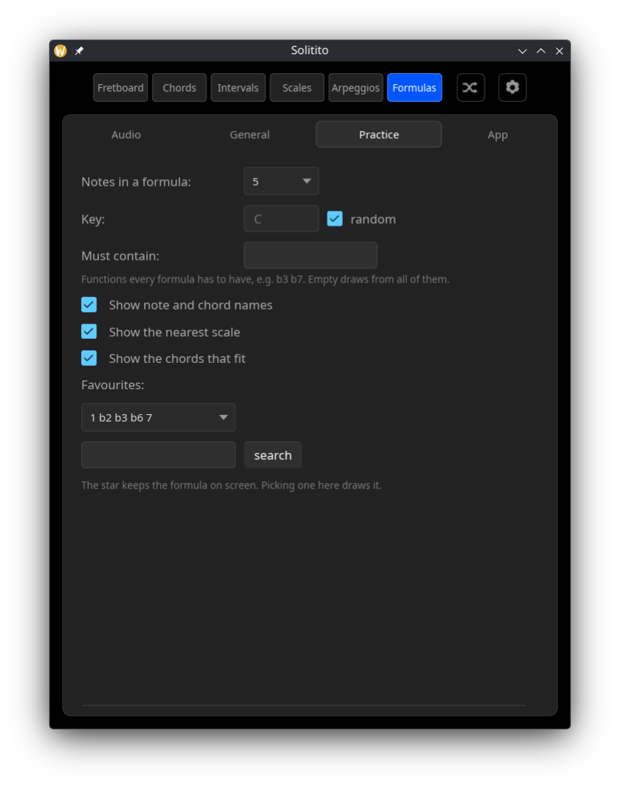
</div>

| Setting | Description |
|---|---|
| **Song / Scale** | Chooses the progression or scale for the current mode |
| **Study** | Arpeggios, in the study exercise: which phrase to walk. The shuffle switch means the KEY here: a new one after every pass. An arpeggio is a phrase, so there is nothing in it to shuffle, and the study itself is left as chosen — the generator is a row in the list for anyone who wants a fresh phrase as well. The three chord-quality studies come first, then the broken thirds and triplets, then plain two-octave runs, and last a generator that builds a fresh phrase after every pass. The second combo beside it holds the key |
| **Exercise** (arpeggios) | *Study in a key* stands on one chord — its quality is set below, its key beside the study, and the shuffle draws a new key after every pass. *Over the changes* takes the chords from a tune and builds one arpeggio per chord |
| **Direction** | Over the changes: ascending, descending, or alternating from either side. Descending is the shape the studies use — from the root **downwards** through the chord's own tones, not the ascending phrase read backwards |
| **View** | Three ways to show the exercise: the line of degree names, tablature, or the neck itself. Tablature by default. A phrase — a scale or an arpeggio — is drawn on the neck it is played on, with the note due ringed in white and every place already played green. An up-and-down phrase comes back to its own places, so by the turn the shape is green all through and the ring is what says where the player is on the way down — the tablature rings it too, which is what tells you where you are in a scale dealt in a drawn order; the picture is the size of a hand however long the phrase is, so a thirty-note study stays readable. A scale is drawn in a position drawn at random — the shape is the same everywhere, and the point is to know it wherever the hand lands. In the fretboard trainer the picture is the REGION: the strings named down the left, the ones out of play dimmed, the frets in play, and — once something is played — every place inside it where the note that sounded lies: green if it is the one asked for, red if it is not. Nothing is drawn before that; where the note lies is the exercise. Each dot carries the degree as the exercise writes it, so a scale spelling its altered second `#2` reads `♯2` on the neck too. In Intervals the set is drawn as a GRIP: a chord box like the shape diagrams, strings across and frets down, with the position beside it — a strip has the ORDER of the notes on its horizontal axis, which says nothing about where the fingers go. The voices are led from the chord before, so the fingers barely move from one to the next. With the shuffle on there is no line to lead: the chords come in a drawn order and each grip is taken where the neck offers it. Which string a dot sits on is the octave, so nothing needs an apostrophe; what has been played lights green either way |
| **Fret numbers instead of degrees** | In that drawing only. The root keeps its colour |
| **Key** | Scales only: the tonic. With random order on, it is redrawn after each pass |
| **Intervals** | Which degrees to practise. `1 3 5` for triads, `1 3 5 7` for sevenths, `1 3` for shell voicings. `3` matches both major and minor thirds, `5` matches perfect and diminished fifths, according to the chord quality |
| **Show AI Debug in Main Window** | Shows the raw prediction on the main screen |
| **Input** | Which capture device to open. *System default* follows whatever the OS is set to. Saved, and falls back to the default if that device is gone |
| **Channel** | Which input of that device to listen on — a guitar in socket 2 of an interface is channel 2. Shown only when the device has more than one, and there is no mixing option: averaging the inputs pulls in whatever is on the other socket and costs 6 dB |
| **Noise gate** | Threshold in dBFS. The bar below shows the current input level on the same scale, with the threshold marked in red — set it just above the noise with the strings untouched |
| **Bass Boost** | Digital amplification of the lowest CQT bins. Useful for laptop microphones, which usually roll off the low strings |
| **Lock chord quality until new attack** | Holds the recognised quality until you strike the strings again. Without it, a held `m7` turns into `m` as the seventh dies away |
| **Judge short strums on the attack** | For chords struck and released rather than held. One clear reading of the target counts, and the decay that follows cannot undo it. A wrong chord still fails |
| **Credit only what was struck** | Note modes: the model may credit a note only where the onset head also heard an attack. Measured on a recording of single notes, two thirds of the credits it hands to a note other than the one being played carry no attack at all — almost always the previous note, still ringing inside its 0.77 s window. Off by default: a note whose attack the head misses then has only the CQT branch left |
| **Play the notes one at a time** | Note modes only. Off, a strummed chord passes its intervals one after another — the pitch head is polyphonic and reports every tone at once. On, each note has to be played on its own and the CQT estimate overrules the model |
| **Random order** | The shuffle icon on the toolbar. In the note modes it shuffles the tones inside each chord; in Chords it reorders the progression, and in Scales it redraws the key after every pass |
| **Shuffle the chords as well** | Intervals and Arpeggios only, and only with the shuffle on. Off, the progression stays as written and just the tones move — shuffled intervals walking a real progression turn into tunes. On, the chords are drawn at random too, which is the more abstract exercise |
| **Exercise** (formulas) | *Formula in a key* is the mode as it was. *Over a chord* plants the same formula on one drawn chord, and *Over the changes* plants it on every chord of a tune in turn — the formula is the constant, the harmony moves under it |
| **Placement** | Over a chord: which kind to draw — one that spells the chord out, one that colours it, one outside it, or any. The screen shows the formula's functions read from the chord's root, with the chord's own tones in blue, and counts them |
| **Notes in a formula** | Formulas only: how many functions each drawn formula has, the root included |
| **Key** (formulas) | The root to read them against, or a fresh one drawn per formula |
| **Must contain** | Only draw formulas holding these functions, e.g. `b3 b7`. Empty draws from all 2048 |
| **Show note and chord names** | Formulas only: the letters under the functions and under the chords |
| **Show the nearest scale** | Formulas only: the closest scale you already know, spelled out with the formula's own degrees picked out |
| **Show the chords that fit** | Formulas only: chords playable without leaving the set, written as degrees. Only the fullest — over the major scale that leaves exactly the seven diatonic sevenths |
| **Favourites** | Formulas only: the star keeps the formula on screen under a name, and the list draws it again. A cross on a row throws it out |
| **Play the notes in order** | Formulas only: the set has to be walked lowest function first. Off, it is a set — any of them, in any order |
| **Console debug** | Prints a line for every function credited, with what was heard. A window on the judging; on Windows a release build has no console to print it to |
| **End on the root again** | Scales only: the run reads 1 2 3 4 5 6 7 1, the last one an octave up. It is a step of its own and has to be played |
| **Show chord shapes** | The diagram thumbnails under the chord name in Chords mode |
| **Shapes** | Two boxes: the full grips and shell voicings — third and seventh over the root. Both ticked draws both, neither draws none. Past four shapes they are drawn in two rows. A `m7b5` has no shell of its own: its shell is the `m7` shell note for note, since the fifth is the only place the two differ, so that is what is drawn, captioned *substitute: the m7 shell*. With shells the only shapes on screen that grip is the one being asked for, so playing it passes green; with the full shapes drawn too, a `m7` reading means the flat fifth was missed and it stays yellow. A diminished seventh has nothing to leave out — its four notes are all a minor third apart, with no third-and-seventh pair to keep — so it keeps its full grips, captioned with what they also are: a `7b9` without its root, from a semitone below any of its notes |
| **Startup mode** | Which mode the app opens in |
| **Language** | Auto (from the system locale), Polski, English. Applied immediately, no restart |
| **Chord confidence** | How sure the model must be of the chord *name* before it counts (Chords mode) |
| **Note threshold** | How sure the model must be that a *single note* is sounding (Intervals / Scales / Arpeggios) |
| **Hold time** | How long a correct chord must be held before advancing. Chords only: a single note is credited as soon as it is recognised, which in the note modes and the fretboard trainer is a fixed 0.12 s |

The line under `Channel` says what actually opened — device, sample rate, channel count
and sample format. `./solitito --help` lists every option. `./solitito --devices` prints the same information for every device the backend can see, and `./solitito --bench` times one model inference — the app asks the model every 40 ms while a chord rings, so that figure is essentially the whole of its CPU load. A release build has the `windows` subsystem, so on Windows these modes write to the console that launched them; started with no console at all — from a shortcut carrying the flag — the program opens one of its own and waits for a key, so the report can be read.

---

## Read on

The rest of the documentation lives in `docs/`, so this page stays about what the app is and
how to set it up.

| | |
|---|---|
| [**Practising with formulas**](docs/formulas-practice.md) | Step by step through the three formula exercises: what to play, what to listen for, and what each row on the screen is telling you |
| [Choosing an input](docs/audio-input.md) | What the device names mean on Linux, where settings are stored, and the diagnostic modes |
| [How it works](docs/how-it-works.md) | Signal path, the model, and why single notes are not judged by the model alone |
| [Training data and results](docs/training-data.md) | The synthetic set, GuitarSet, and what each fix was worth |
| [Custom file formats](docs/file-formats.md) | Your own songs and scales |
| [Running it](docs/running.md) | Packages, and building from source |

## Detailed Project summary

`docs/` holds a long-form write-up of the whole system: architecture, the four
GuitarSet defects and what fixing each one was worth, the training procedure,
the measurements behind every design decision, and the hypotheses that
measurement refuted. Same document in two languages, Markdown and PDF.

| file | |
|---|---|
| [`docs/Solitito_project_summary_en.md`](docs/Solitito_project_summary_en.md) | [PDF](docs/Solitito_project_summary_en.pdf) |
| [`docs/Solitito_project_summary_pl.md`](docs/Solitito_project_summary_pl.md) | [PDF](docs/Solitito_project_summary_pl.pdf) |

## Repository and dataset

- Model and DSP weights: <https://huggingface.co/greblus/solitito-ai>
- Dataset v2 (renders and annotations): <https://huggingface.co/datasets/greblus/solitito_dataset_v2>

Those two hold binary artifacts only. All code lives here.

The `dist/` directory contains everything used to build the dataset and train the model:

| file | role |
|---|---|
| `dataset_generator_v2.py` | generates the GP5 **and** the annotations; self-tests all shapes |
| `verify_annotations.py` | checks that labels describe the audio (numpy only, no librosa) |
| `model_trainer.py` | training; runs on Kaggle, checkpoints to Hugging Face |
| `gen_weights.py` | sparse pseudo-CQT weights for the Rust side |
| `probe_root.py` | how often the labelled root is actually audible |
| `probe_quality.py` | where chord quality should come from: the head or the pitch vector |
| `probe_sources.py` | which GuitarSet chord annotation to use |
| `inspect_jams.py` | what is actually inside the JAMS files |
| `latency_material.py` | plucks with onsets known by construction, as a yardstick |
| `latency_ground_truth.py` | onsets and pitches of a real recording, for the same measurement |
| `latency_stats.py` | how late the app learns what was played, and how often it learns it wrong |
| `latency_rules.py` | what each crediting rule would cost: credits nobody played, notes missed |
| `gp5_to_arpeggio.py` | turns a Guitar Pro file into the degree notation Arpeggios reads |
| `hf_cleanup.py` | clears the checkpoint repository before a run started from scratch |

---

[1] This project uses the GuitarSet dataset by Qingyang Xi, Rachel M. Bittner, Johan Pauwels,
Xuzhou Ye & Juan P. Bello, available at <https://guitarset.weebly.com/>, licensed under
Creative Commons Attribution 4.0 International (CC BY 4.0).
